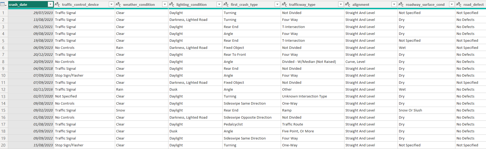

# Metropolis Traffic Crash Analysis Report (2016–2025)
Analyzing Traffic Crash Trends and Injury Severity from 2016-2025 Using Power BI

## Executive Summary
- This report provides an analytical overview of traffic crash data from 2016 to 2025.
- The objective of the analysis is to identify trends in total crashes, injury-related crashes, and fatal incidents while highlighting year-over-year (YoY) performance changes.
- Using an interactive Power BI dashboard, complex crash records were transformed into intuitive KPIs, trend analyses, and categorical insights to support data-driven decision-making.

## The Traffic problem
Traffic safety stakeholders often lack a centralized, interactive platform to:
- Monitor crash trends over time
- Compare year-over-year performance
- Identify high-risk injury severities and contributing causes

### Key Questions Addressed:
- How have total crashes and injury crashes changed year-over-year?
- Which injury severity categories dominate crash records?
- What are the leading contributing causes of severe and fatal crashes?

## The Process (Methodology)
### Tools Used:
Power BI, Power Query, DAX

### Data Sourcing & Overview
The dataset contains traffic crash records including crash dates, injury severity levels, and primary contributory causes.
Analysis was restricted to 2016–2025, in line with the project brief.

### Data Cleaning & Transformation (ETL)
- Filtered records to include only 2016–2025
- Handled null and “Unknown” values appropriately
- Standardized date and categorical fields
- Created a Date Table to enable time intelligence calculations (YoY, trends)

## Analysis and Key Insights
### Crash Trends
- Total crashes and injury crashes show clear seasonal and yearly patterns
- YoY KPIs highlight periods of improvement and concern

### Injury Severity Distribution
- Majority of crashes fall under No Injury and Non-Incapacitating Injury
- Fatal and incapacitating crashes form a smaller proportion but represent higher risk

### Contributing Causes
- A small number of contributory causes account for most severe and fatal crashes
- These causes present opportunities for targeted intervention

## Recommendations
- Focus safety interventions on top contributory causes
- Monitor years with repeated YoY increases
- Use the Power BI dashboard for continuous policy evaluation
- Expand future analysis with geographic or demographic data

## Links
[interactive Power BI Dashboard](https://app.powerbi.com/view?r=eyJrIjoiZDNhNzAwMzYtZGFjYi00NTEwLWIyMjItOTkyMGY2ZDcxZDRhIiwidCI6IjBlYTAxMTRjLWFlZGQtNGE3ZC1hNDRmLTRlYWE5MTkwNDQxNCJ9)

